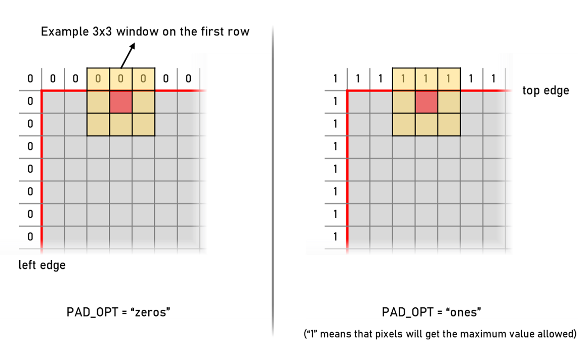

# 2D Median Filtering Module with VBUS interface

<!--
## Table of Contents
 1. [Overview](#Overview)
 2. [Applications](#Applications)
 3. [Resource Utilization](#Resource)
 4. [Operation](#Operation)
 5. [Parameters](#Parameters)
 6. [Pinout](#Pinout)
 7. [Interfaces](#Interfaces)
 8. [Source Files](#Source)
 9. [Padding Options](#Padding)
 10. [Simulation](#Simulation)
-->

## Overview
A 2D median filtering implementation in Verilog.
*	Synthesizable, technology independent Verilog IP Core
*	Apply median filtering to input stream
*	All signals synchronous with the input clock
*	Supports kernel size 3x3 fully; larger size kernels (e.g. 5x5) provides rough sorting !!!
*	Supports masking; apply filtering only to non-mask regions
* 	Supports padding zeros/ones to regions outside image
*	FPGA proven (Tested on XC7A100T)
 

## Applications
* Noise Filtering
* Salt and pepper noise removal
* Dead/bad pixel correction
and many more...
 

## Resource
##### Window Size = 3x3
|Part|Data Width|LUTs|Registers |BRAM|
|-|-:|-|-|-|
|Lattice Crosslink NX (LIFCL-40)|8|1203 (3.73 %)|372 (1.13%)|15 EBR (17.0 %)
|Xilinx Artix 7 (XC7A100T)|8|1055 (1.66%)|971 (0.77%)|7.5 BRAM (0.77%)

 

## Operation
#### *Block Diagram*

 

**Figure 1.** The block diagram above describes the operation of this median filtering module.

#### *Programming*
Everything starts with programming the registers for WIDTH and HEIGHT parameters through slave memory bus interface. This operation causes an internal reset pulse generation. Additionally, EN bit should also be set to 1.

#### *Buffering*
If a valid video stream is given to slave video bus of the module, the pixels will be received to line buffers shown in the yellow block.

#### *Sorting and Median Finding*
When enough pixels are buffered, pixel stacks (one pixel from each line buffer) will be fed to sorting pipeline block shown in blue color. This module is responsible for finding the median from the pixels in the current window.

|Important Note|
|:-|
|The sorting block outputs the median value only for 3x3 window size.  For sizes larger than 3x3, the module performs a rough sorting. Consequently, a value close-neighbouring the median is given instead of exact median. This does not degrade the performance of filtering so much contrary to what is generally believed. |

#### *Output buffers*
Output buffering module gets processed lines from sorting block into a FIFO. These lines are then output through master video bus interface.

## Parameters
|Parameter Name|Description|Type|Valid Range|
|-|-|-|-|
|DW_VD		|Data width		|	integer	|DW_VD>1|
|SIZE		|Kernel size    Note: The case where SIZE=3 performs full median filtering.   When set to sizes > 3, the module performs partial sorting and does not guarantee finding the exact medians. |integer	| 3, 5, 7, …. |
|IN_BUF_LEN	|Input buffer depth|integer|Powers of two|
|OUT_BUF_LEN|Output buffer depth|Powers of two|
|USE_VENDOR_FIFO|This parameter selects the FIFO instantiation source in the design.  If this is set to 0, then “sync_fifo_generic” module will be used for instantiation where a FIFO is needed.  If this is set to 1, then “sync_fifo_vendor” module will be used.   If planning to use this source, you need to generate a vendor FIFO IP in your environment and instantiate it under “sync_fifo_vendor” module.  In order to reduce the number of used resources/LUTs in a FPGA, the recommended way is using “sync_fifo_vendor” where you utilize built-in dedicated resources.|integer|	0 or 1|
|PAD_OPT|“zeros” : Assume zero valued pixels outside the image frame  “ones” : Assume 2DW_VD-1 valued pixels outside the image frame|string|	“zeros” or “ones”|

 

## Pinout Description

|Pin Name	|I/O	|Description		|Active State	|
|-			|-		|-					|-				|
|clk		|in		|Module clock		|rising edge	|
|rstb		|in		|Asynchronous reset	|low			|
|**SLAVE VIDEO BUS**			
|s_vb_aux [3:0]|in	|Slave video bus auxiliary data  [0]: SOF  [1]: EOL  [2]: MSK [3]: don’t care|high|
|s_vb_dat[DW_VD-1:0]|in	|Slave video bus pixel data|data|
|s_vb_val|in	|Data valid flag	|high|
|s_vb_rdy|out	|Ready to accept input data |high (handshake signal)|
|**MASTER VIDEO BUS**|
|m_vb_aux [3:0]	|out|	Master video bus auxiliary data  [0]: SOF  [1]: EOL  [2]: MSK  [3]: don’t care|	high|
|m_vb_dat[DW_VD-1:0]|	out	|Master video bus pixel data|data|
|m_vb_val|out	|Data valid flag	|high|
|m_vb_rdy|in	|Ready to accept input data	|high (handshake signal)|
|**SLAVE MEMORY BUS**|
|s_mb_adr [7:0]	|in	|Memory bus address		|data	|
|s_mb_wdt [15:0]|in	|Memory bus write data	|data	|
|s_mb_rdt [15:0]|out|Memory bus read data	|data	|
|s_mb_val		|in	|Memory bus write valid	|high	|

 

## Interfaces
### VBUS Interface
This is the stream interface used in this IP. It consists of 4 signals/buses:
- DAT: data bus
- AUX: auxiliary data bus, includes SOF, EOL and MSK
- VAL: data valid bus (handshaking)
- RDY: ready to receive (handshaking)

In the following waveforms, how these signals are formed when a valid transaction is being performed is described.
A together assertion of VAL and RDY signals with the rising edge is a valid pixel transaction. The first pixel in the first line should be sent with SOF asserted. And the last pixel of every line should be sent with EOL asserted.
If filtering with mask is desired, MSK can be asserted with any pixel transaction.

 

**Figure 2.** Input waveforms showing the start of a new frame/first line (top) and end of a line (bottom)
 

### MBUS Interface
This interface consists of 4 signals/buses and used to configure the memory of IP. The interface has the same signals a block memory interface has. So, it is very simple.

- ADR: memory address
- WDT: write data
- RDT: read data
- VAL: write enable

## Source Files
All source files are provided as text files coded in Verilog/SystemVerilog. The following table gives a brief explanation of each file.

|Source file			|Description							|
|-						|-										|
|**Design**				|										|
|median_filt.v			|Median filter top module				|
|median_filt_buf.v		|Line buffering							|
|median_filt_conf.v		|IP configuration memory				|
|median_filt_core.v		|Finds median in a given matrix			|
|median_filt_filt.v		|Filtering logic with core				|
|median_filt_tx.v		|Transmitter block with a buffer		|
|sync_fifo.v			|Instantiated FIFO used everywhere buffering needed|
|sync_fifo_generic.v	|Generic synchronized FIFO implementation|
|sync_fifo_vendor.v		|Template file for vendor FIFO IP instantiation |
|reset_gen.v			|Reset generation module				|
|sort_NxN.v				|Sorting blocks							|
|sort_N.v				|Sorting blocks							|
|transpose_NxN.v		|Sorting blocks							|
|dia_data_NxN.v			|Sorting blocks							|
|single_pass_sorter.v	|Sorting blocks							|
|comparator.v			|Sorting blocks							|
|**Simulation**			|										|
|tb.sv					|Top testbench module					|
|frame_timing_gen.v		|Video timing generation in TB			|
|pgm_reader.sv			|Read PGM image files into TB			|
|parallel_2_vbus.v		|Converts parallel video bus to VBUS	|
|vbus_2_parallel.v		|Converts VBUS to parallel video bus 	|
|file_frame_grabber.sv	|Grabs frames from parallel video bus and record them to PGM files  	|
|file_compare.sv		|Reads and compares two files			|
 

## Padding Options

 

**Figure 3.** An example window placement is shown at the top edge of an image.  When `PAD_OPT = "zeros"`, outside pixel values are assumed to zero (left).  If `PAD_OPT = "ones"`, then these pixels will get the maximum value allowed (right) (e.g. 4095 for BPP=12)

## Simulation
In the **sim** folder, there is a "**.do**" file for automated simulations. You can use Modelsim to make simulations.
#### Modelsim
In order to run a simulation in Modelsim:
1. Run Modelsim
2. Change directory to "sim" folder with "cd" command
3. Enter "do sim.do"

The modelsim will run the simulation.

#### Other
If you want to use another simulator tool, .do file can be helpful
